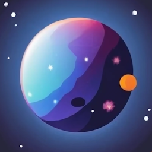

 

 

<h1><b>neso</b></h1>

front-end to NASA's Astronomy Picture of the Day (APOD) API

<a style="font-size: large;" href="https://neso.vercel.app/"><strong>neso.vercel.app</strong></a>

 

built with

